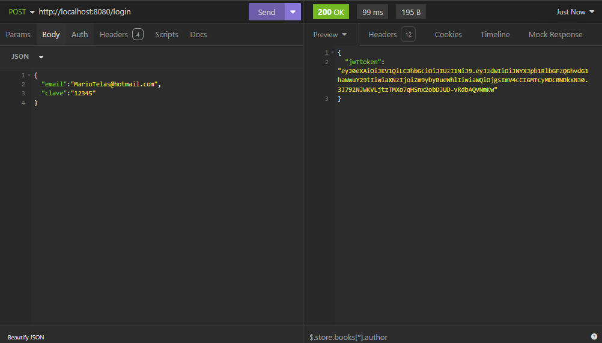

<h1 style="text-align:center; display:none;">Reto Alura</h1>

<h2 style="text-align:center" >Daniel Jesus Vadillo Cocom</h2>

Como parte de mi proyecto final se creó un foro al estilo ALURA, donde se incluyen la creación de Topico, Usuarios y Perfiles, esto es más un CRUD de foros, con la finalidad de poner en practica los conocimientos de JAVA Spring Boot 3, También se implementó el sistema de Seguridad.

<h3>Funcionalidades del programa</h3>
<ul>
    <li>
    <h5>Listar Topicos</h5>
    
Como parte de un sistema REST el Foro puede listar de manera en paginación los topicos devolviendo un JSON con la información, es importante recalcar que solo se listan los topicos con el Status true

    
    </li>
    <li>
    <h5>Ver Topico Detallado</h5>
    
En caso de que solo se desee ver la información de un Topico se coloca el URL con el ID del topico

    
    </li>
     <li>
    <h5>Eliminar Topico</h5>
    
Al igual que el detallado, se coloca el ID para posteriormente crear una comprobación de que realmente existe y después enviar la solicitud al JPA de un metodo Delete para la base de datos.

    
    </li>
     <li>
    <h5>Actualizar Topico</h5>
    
En este caso de actualizar los campos de Titulo, mensaje y el status para el caso que el topico desee ser eliminado de la vista principal pero no eliminado de la base de datos.

    
    </li>
     <li>
    <h5>Crear Usuario</h5>
    
Como parte de un sistema de seguridad se crea un usuario para poder acceder a la información, este usuario solo puede ser creado por un usuario con un Token inicial. 

     
    </li>
     <li>
    <h5>Inicio de Sesion</h5>
    
Como forma de verificación se utiliza el Correo electronico para poder acceder como usuario, además que la contraseña que no tiene limitaciones.

    
    </li>
    <h3>Base de datos</h3>
    
    
</ul>

   
<ul>
<li>Java 17</li>
<li>Spring Boot 3.3.1</li>
<li>WampServer 3.2.6</li>
<li>MySQL 5.7.36 </li>
<li>Insomnia 9.3.2</li>
</ul>

